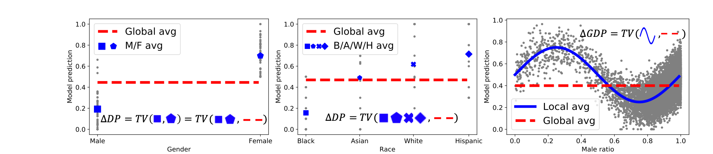

# Generalized Demographic Parity for Group Fairness

[](https://opensource.org/licenses/MIT)

Codes for [ICLR'22] [Generalized Demographic Parity for Group Fairness](https://openreview.net/forum?id=YigKlMJwjye&referrer=%5BAuthor%20Console%5D(%2Fgroup%3Fid%3DICLR.cc%2F2022%2FConference%2FAuthors%23your-submissions)).

Zhimeng Jiang, Xiaotian Han, Chao Fan, Fan Yang, Ali Mostafavi, Xia Hu

## GDP Overview



## Implementations of GDP
### Set Environment

```bash
conda env create -f environment.yml
```
### Dataset
1. Tabular data: Adults and Crimes dataset can be downloaded from (https://archive.ics.uci.edu/ml/datasets/adult) and (https://archive.ics.uci.edu/ml/datasets/communities+and+crime)

2. Graph data: Pokec_z and Pokec_n can be downloaded from (https://github.com/EnyanDai/FairGNN/tree/main/dataset/pokec) as `region_job.xxx` and `region_job_2.xxx`, respectively.
They are sampled from [soc_Pokec](http://snap.stanford.edu/data/soc-Pokec.html). 

### Reproduce the results

To reproduce the performance reported in the paper, you can run the bash files in folders `tabular\`,`graph\` and `comp\`.
```
cd tabular
bash run_dnn.sh
bash run_dnn_adv.sh
```

## Citation

```
@inproceedings{jiang2022generalized,
  title={Generalized Demographic Parity for Group Fairness},
  author={Jiang, Zhimeng and Han, Xiaotian and Fan, Chao and Yang, Fan and Mostafavi, Ali and Hu, Xia},
  booktitle={International Conference on Learning Representations},
  year={2022}
}
```

## License
[MIT](https://choosealicense.com/licenses/mit/)